# Vistas en Odoo 19 — {Nombre Apellidos}
**Reto:** Reto_01_Vistas_Odoo19_{Nombre}_{Apellidos}  
**Proyecto:** Proyecto_RA3_UT3  
**Fecha:** 2025-11-21

> Documento **único** con todas las vistas. Usa **Developer Mode** para confirmar cada tipo de vista.

## Índice
1. [Guía rápida para localizar vistas](#guía-rápida-para-localizar-vistas)
2. [Modo desarrollador: cómo verificar el tipo de vista](#modo-desarrollador-cómo-verificar-el-tipo-de-vista)
3. [Vistas estándar](#vistas-estándar)
   - [01 List / Tree](#01-list--tree)
   - [02 Form](#02-form)
   - [03 Kanban](#03-kanban)
   - [04 Search](#04-search)
   - [05 Calendar](#05-calendar)
   - [06 Graph](#06-graph)
   - [07 Pivot](#07-pivot)
4. [Vistas especiales](#vistas-especiales)
   - [08 Activity](#08-activity)
   - [09 Cohort (Enterprise)](#09-cohort-enterprise)
   - [10 Gantt (Enterprise)](#10-gantt-enterprise)
   - [11 Grid (Enterprise)](#11-grid-enterprise)
   - [12 Map (Enterprise)](#12-map-enterprise)
   - [13 Hierarchy](#13-hierarchy)
   - [14 QWeb (reportes/dashboards)](#14-qweb-reportesdashboards)
5. [Checklist final](#checklist-final)

---

## Guía rápida para localizar vistas
- **List / Tree**: Contactos, Facturas, Oportunidades. Icono de **tabla** en la barra de vistas.
- **Form**: Abre cualquier registro desde la lista.
- **Kanban**: CRM → Oportunidades → icono de **columnas/pipeline**.
- **Search**: Barra de búsqueda/filtros sobre listas/kanban.
- **Calendar**: Módulo Calendario; también Project (tareas), CRM.
- **Graph / Pivot**: Menú *Reporting* en Ventas, Project, Facturación, etc.
- **Activity**: CRM → Oportunidades → icono de **reloj**.
- **Cohort** *(Ent.)*: CRM / Suscripciones / Helpdesk → *Reporting → Cohort* (según módulos).
- **Gantt** *(Ent.)*: Project / Planning → icono de **Gantt**.
- **Grid** *(Ent.)*: Planning / Forecast / Timesheets.
- **Map** *(Ent.)*: Contactos/CRM con módulo de mapa instalado.
- **Hierarchy**: RRHH → Empleados → Departamentos → **Hierarchy view**.
- **QWeb**: Imprimir un **reporte** (ej. Factura) o dashboards QWeb.

---

## Modo desarrollador: cómo verificar el tipo de vista
1. Activa **Developer Mode** (Preferencias → Activar modo desarrollador).
2. En la vista actual, usa el **icono del bug** → *Editar vista*.
3. Anota:
   - **Tipo** (`tree`, `form`, `kanban`, `search`, `calendar`, `graph`, `pivot`, `activity`, `cohort`, `gantt`, `grid`, `map`, `hierarchy`…)
   - **Modelo** y **Nombre técnico**.
   - **Vista heredada** si aplica.

---

## Vistas estándar

### 01 List / Tree
**Dónde**: Contactos, Facturas, Oportunidades.  
**Cómo llegar**: Navega al menú, pulsa el **icono de tabla**.  
**Comprobación (dev mode)**: *Editar vista* → tipo `tree`.  
**Capturas**:  
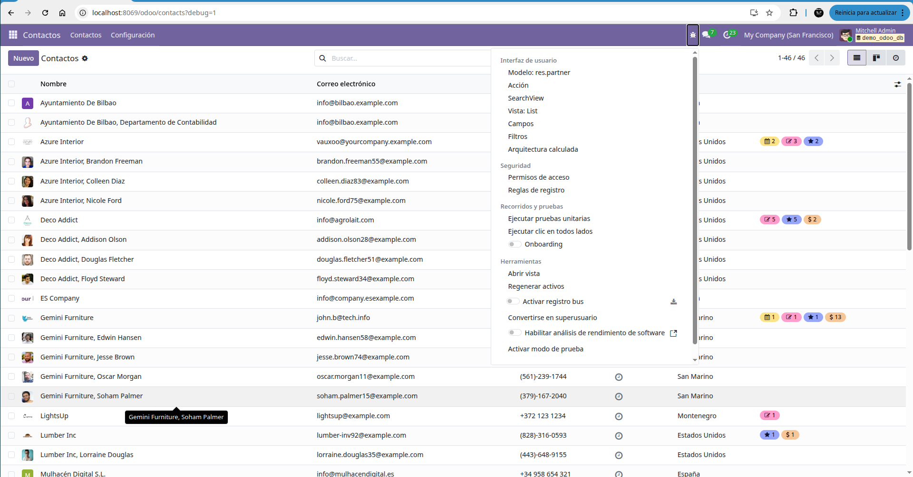
### 02 Form
**Dónde**: Clic en un registro desde la lista.  
**Comprobación**: tipo `form`.  
**Capturas**:  
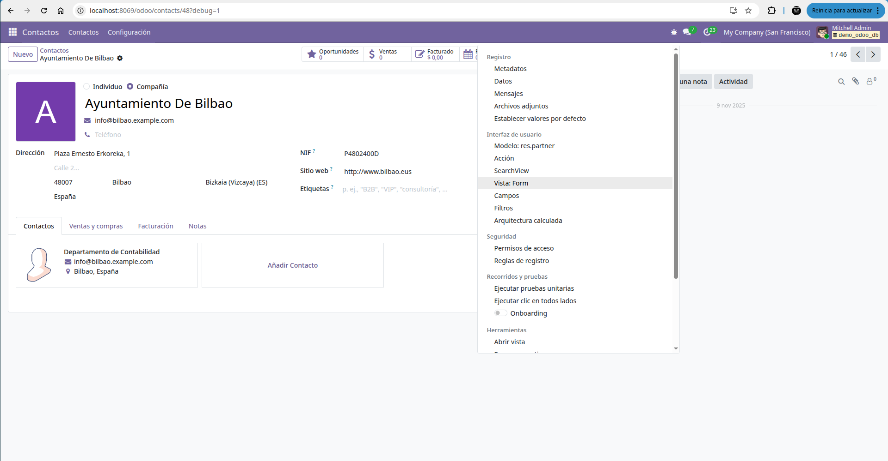

### 03 Kanban
**Dónde**: CRM → Oportunidades → icono columnas.  
**Comprobación**: tipo `kanban`.  
**Capturas**:  
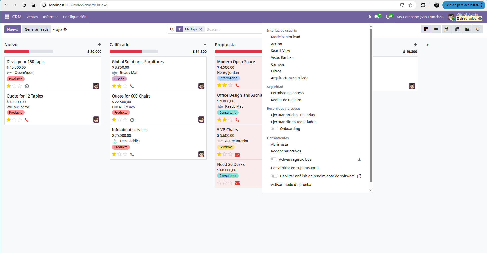

### 04 Search
**Dónde**: Barra superior en listas/kanban.  
**Comprobación**: tipo `search` (estructura técnica).  
**Capturas**:  
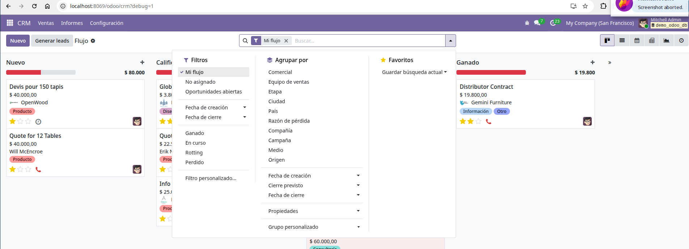

### 05 Calendar
**Dónde**: Calendario / Project / CRM.  
**Comprobación**: tipo `calendar`.  
**Capturas**:  
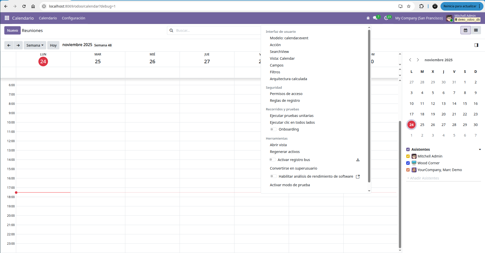

### 06 Graph
**Dónde**: *Reporting* en varios módulos.  
**Comprobación**: tipo `graph`.  
**Capturas**:  
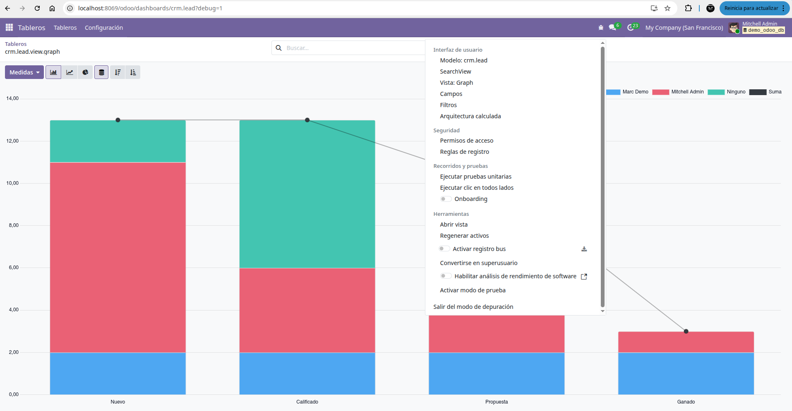

### 07 Pivot
**Dónde**: *Reporting*.  
**Comprobación**: tipo `pivot`.  
**Capturas**:  
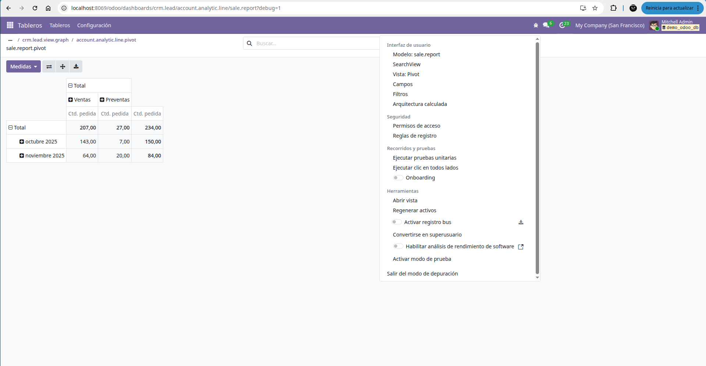

---

## Vistas especiales

### 08 Activity
**Dónde**: CRM → Oportunidades → icono **reloj**.  
**Comprobación**: tipo `activity`.  
**Capturas**:  
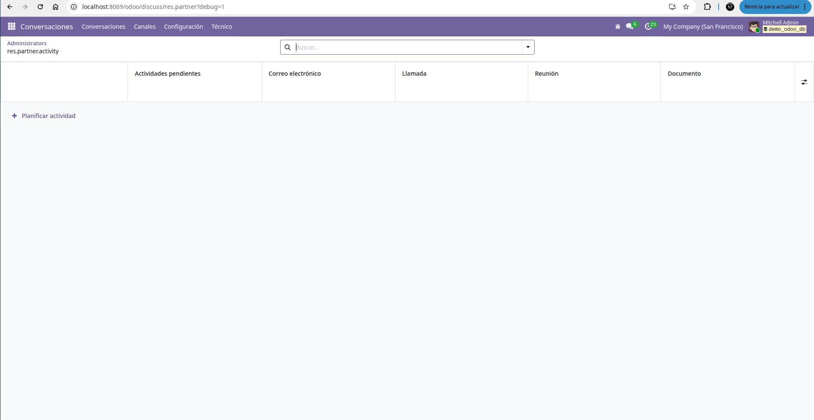

### 09 Cohort (Enterprise)
**Dónde**: CRM/Helpdesk/Suscripciones → *Reporting → Cohort*.  
**Comprobación**: tipo `cohort`.  
**Alternativa**: si no está disponible, captura de **documentación oficial** (URL visible) + explicación.  
**Capturas**:  
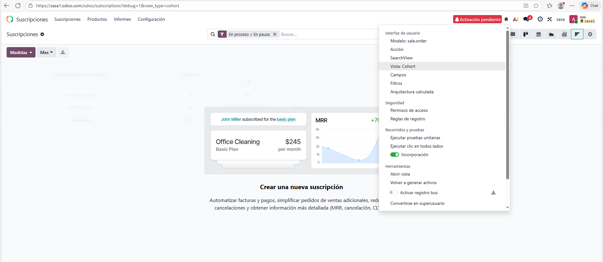

### 10 Gantt (Enterprise)
**Dónde**: Project/Planning → icono **Gantt**.  
**Comprobación**: tipo `gantt`.  
**Alternativa**: documentación oficial (URL visible).  
**Capturas**:  
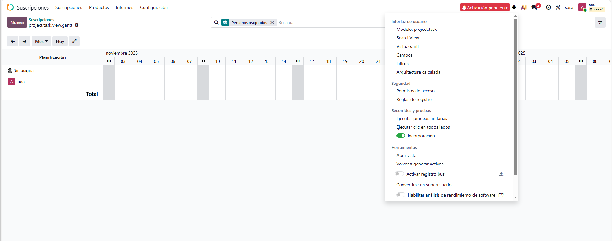

### 11 Grid (Enterprise)
**Dónde**: Planning / Forecast / Timesheets.  
**Comprobación**: tipo `grid`.  
**Alternativa**: documentación oficial (URL visible).  
**Capturas**:  
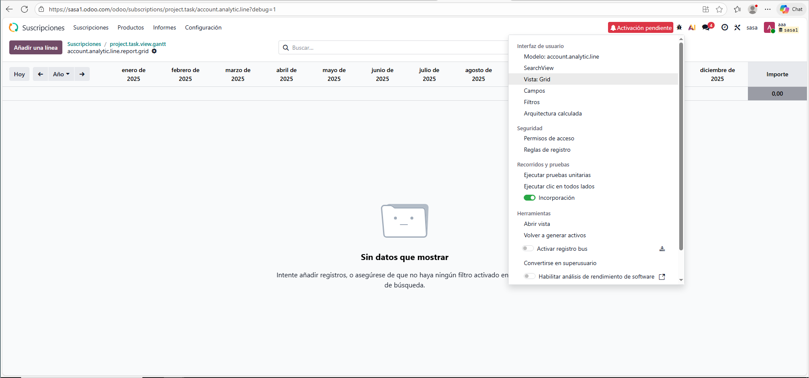

### 12 Map (Enterprise)
**Dónde**: Contactos / CRM (con módulo de mapas).  
**Comprobación**: tipo `map`.  
**Alternativa**: documentación oficial (URL visible).  
**Capturas**:  
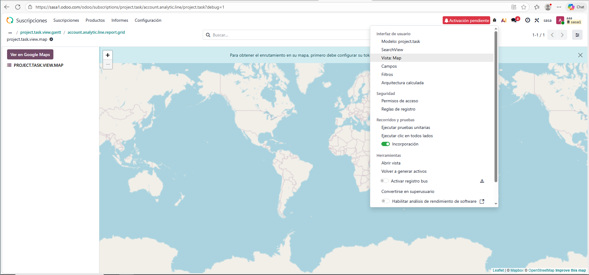

### 13 Hierarchy
**Dónde**: RRHH → Empleados → Departamentos → **Hierarchy**.  
**Comprobación**: tipo `hierarchy`.  
**Capturas**:  
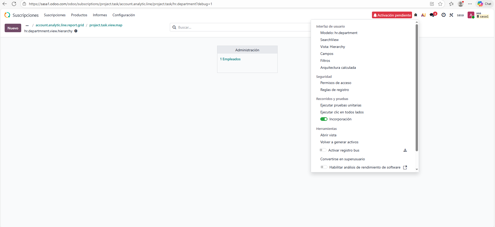

### 14 QWeb (reportes/dashboards)
**Dónde**: Factura → **Imprimir Factura**, o dashboards.  
**Comprobación**: reporte QWeb (no es vista UI clásica). Indica acción y plantilla.  
**Capturas**:  
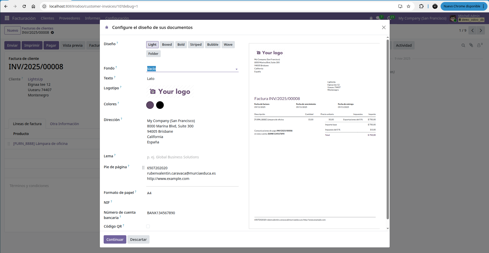

---

## Checklist final
- [ ] Todas las **vistas cubiertas** (o alternativa con documentación oficial).
- [ ] **Developer Mode** usado y **tipo de vista verificado** en cada sección.
- [ ] **Capturas nítidas**, rutas relativas correctas y `alt/title` informativos.
- [ ] Se indica **cómo llegar** a cada vista desde el menú.
- [ ] **Bibliografía** con fuentes oficiales / artículos técnicos.
- [ ] **PDF único** consolidado generado a partir del Markdown.
